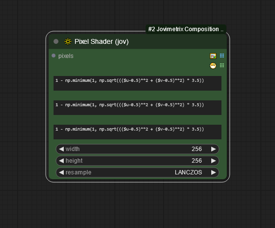
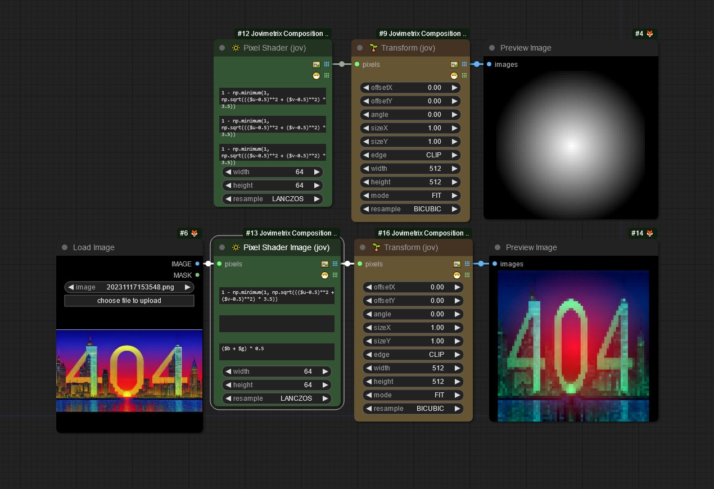
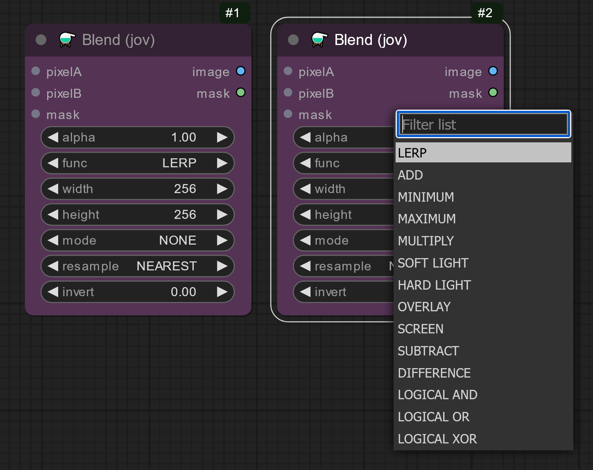
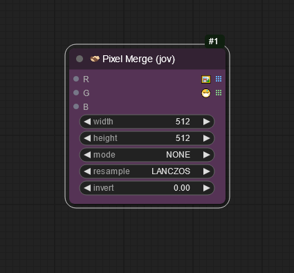
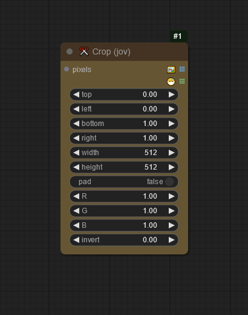
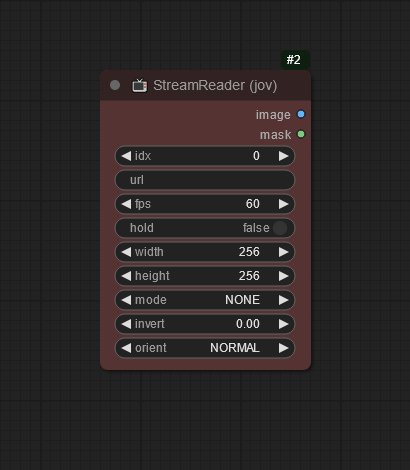
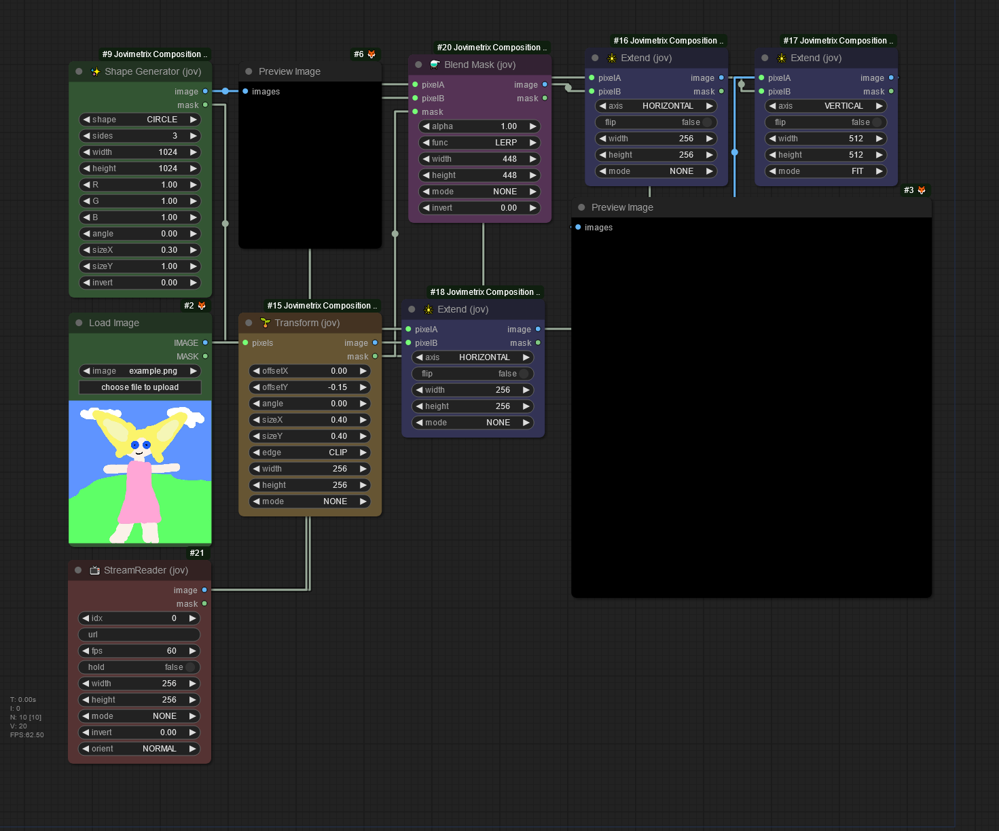

> [!CAUTION]
> <h3><p align="center">⚠️ SUBJECT TO CHANGE PRIOR TO VERSION 1.0. USE AT YOUR OWN RISK ⚠️</p></h3>

<picture>
  <source media="(prefers-color-scheme: dark)" srcset="res/logo-jovimetrix.png">
  <source media="(prefers-color-scheme: light)" srcset="res/logo-jovimetrix-light.png">
  
</picture>

<h3><p align="center">
<a href="https://github.com/comfyanonymous/ComfyUI">COMFYUI</a> Nodes for procedural masking, live composition and video manipulation
</p></h3>

<!---------------------------------------------------------------------------->

# INSTALLATION

If you have [ComfyUI Manager](https://github.com/ltdrdata/ComfyUI-Manager) installed you can search for Jovimetrix and install from the manager's database.

## FFMEPG

The audio nodes require FFMPEG. You can find the official [FFMPEG](https://ffmpeg.org "official FFMPEG binaries") here. Follow it's installation instructions for your specific operating system.

## MANUAL INSTALL
To manually install, clone the repository into your ComfyUI custom_nodes directory. You can clone the repository with the command:
```
git clone https://github.com/Amorano/Jovimetrix.git
```
You can then install the requirements by using the command:
```
.\python_embed\python.exe -s -m pip install -r requirements.txt
```
If you are using a <code>virtual environment</code> (<code><i>venv</i></code>), make sure it is activated before installation. Then install the requirements with the command:
```
pip install -r requirements.txt
```

<!---------------------------------------------------------------------------->

# NODE REFERENCE


</img>

<b><code>COPY</code> [EXAMPLE IMAGES](https://github.com/Amorano/Jovimetrix/tree/main/flow) <code>INTO COMFYUI TO LOAD SHOWN WORKFLOW</code></b>

<details>
  <summary><b>CREATE</b></summary>
  <ul>
    <li>Constant color node for when you need a block of color</li>
    <li>Nodes that generate images and masks in various polygonal shapes
      <ul>
        <li>🟢 Ellipse & Circle </li>
        <li>🟪 Rectangle & Square</li>
        <li>🦚 Polygon of 3 or more sides</li>
      </ul>
    </li>
    * Per Pixel Shader with input support. Slow but works until the  is available. Variables pre-defined for use in the loop include:
      <ul>
        <li><code>$x</code>, <code>$y</code>: Current image (x, y)</li>
        <li><code>$u</code>, <code>$v</code>: Normalized texture coordinates [0..1]</li>
        <li><code>$w</code>, <code>$h</code>: Width and Height of the target output</li>
        <li><code>$ir</code>, <code>$ig</code>, <code>$ib</code>: Red, Green & Blue values for current image input (x, y)</li>
      </ul>
    </li>

NODE | OVERVIEW | COMFY UI
---|---|---
🟪 CONSTANT|Set a single RGB value. Useful for masks, overlays and general filtering|
✨ SHAPE GENERATOR|Generate polyhedra for masking or texture work|
🔆 PER PIXEL SHADER|Per Pixel user function for each R, G, B channel|
🍩 GLSL|GLSL Shader support NOT YET|
  </ul>
  <ul>
    <details>
      <summary><b>🟪 CONSTANT EXAMPLES</b></summary>
      
      </img>
    </details>
    <details>
      <summary><b>✨ SHAPE GENERATOR EXAMPLES</b></summary>
      
      </img>
    </details>
    <details>
      <summary><b>🔆 PER PIXEL SHADER EXAMPLES</b></summary>
      
      </img>
    </details>
    <details>
      <summary><b>🍩 GLSL EXAMPLES</b></summary>
      
      </img>
    </details>
  </ul>
</details>

<!---------------------------------------------------------------------------->

<details>
  <summary><b>ADJUST</b></summary>
  <ul>
    <li>Manipulate lighting and color conditions of an input</li>
    <li>Apply matrix operations to images and masks</li>

NODE | OVERVIEW | COMFY UI
--|---|---
🌈 HSV|Adjust Hue, Saturation, Value, Gamma, Contrast and Exposure of an input|
🕸️ ADJUST|Find Edges, Blur, Sharpen and Emboss an input|
📉 THRESHOLD|Clip an input based on a mid point value|
🛗 LEVELS|Low, Mid, High range clipping|
  </ul>
  <ul>
    <details>
      <summary><b>🌈 HSV EXAMPLES</b></summary>
      
      </img>
    </details>
    <details>
      <summary><b>🕸️ ADJUST EXAMPLES</b></summary>
      
      </img>
    </details>
    <details>
      <summary><b>📉 THRESHOLD EXAMPLES</b></summary>
      
      </img>
    </details>
    <details>
      <summary><b>🛗 LEVELS EXAMPLES</b></summary>
      
      </img>
    </details>
  </ul>
</details>

<!---------------------------------------------------------------------------->

<details>
  <summary><b>TRANSFORM</b></summary>
  <ul>
    <li>Manipulate inputs with affine transformations</li>
    <li>Duplicate and Stack inputs</li>
  </ul>

NODE | OVERVIEW | COMFY UI
--|---|---
🌱 TRS|Translate, Rotate, and Scale without extra options|
🌱 TRANSFORM|Translate, Rotate, and Scale an input. Options allow for CROP or WRAPing of the edges|
🔳 TILE|Repeat an input along the X, Y or XY at irregular intervals|
🔰 MIRROR|Flip an input across the X axis, the Y Axis or both, with independent centers|
🗺️ PROJECTION|Project into various perspective transformaions|

  <ul>
    <details>
      <summary><b>🌱 TRS EXAMPLES</b></summary>
      
      </img>
    </details>
    <details>
      <summary><b>🌱 TRANSFORM EXAMPLES</b></summary>
      
      </img>
    </details>
    <details>
      <summary><b>🔳 TILE EXAMPLES</b></summary>
      
      </img>
    </details>
    <details>
      <summary><b>🔰 MIRROR EXAMPLES</b></summary>
      
      </img>
    </details>
    <details>
      <summary><b>🗺️ PROJECTION EXAMPLES</b></summary>
      
      </img>
    </details>
  </ul>
</details>

<!---------------------------------------------------------------------------->

<details>
  <summary><b>COMPOSE</b></summary>
  <ul>
    <li>Composite Images and Masks together with optional alpha blending.</li>
    <li>Supports many operations; </li>

NODE | OVERVIEW | COMFY UI
--|---|---
⚗️ BLEND|Compose 2 inputs together with optional alpha mask along a linear blend|
💔 PIXEL SPLIT|Splits pixel blocks into it's constituent R, G and B channels|
🫱🏿‍🫲🏼 Pixel Merge|Combines multiple inputs into a single block of pixels|
➕ MERGE|Combine two inputs into a new image, side by side, top-down or in a grid|
✂️ CROP|Clip away sections of an image and backfill the matte|
  </ul>
  <ul>
    <details>
      <summary><b>⚗️ BLEND EXAMPLES</b></summary>
      
      </img>
    </details>
    <details>
      <summary><b>💔 PIXEL SPLIT EXAMPLES</b></summary>
      
      </img>
    </details>
    <details>
      <summary><b>🫱🏿‍🫲🏼 PIXEL MERGE EXAMPLES</b></summary>
      
      </img>
    </details>
    <details>
      <summary><b>➕ MERGE EXAMPLES</b></summary>
      
      </img>
    </details>
    <details>
      <summary><b>✂️ CROP EXAMPLES</b></summary>
      
      </img>
    </details>
  </ul>
</details>

<!---------------------------------------------------------------------------->

<details>
  <summary><b>ANIMATE</b></summary>
  <ul>
    <li></li>

NODE | OVERVIEW | COMFY UI
--|---|---
🕛 TICK|Periodic pulse exporting normalized, delta since last pulse and count.|
⏸️ DELAY|Pause processing the graph at this point for X seconds|
🌊 WAVE GENERATOR|Periodic and Non-Periodic Sinosodials|
  </ul>
  <ul>
    <details>
      <summary><b>🕛 TICK EXAMPLES</b></summary>
      
      </img>
    </details>
    <details>
      <summary><b>⏸️ DELAY EXAMPLES</b></summary>
      
      </img>
    </details>
    <details>
      <summary><b>🌊 WAVE GENERATOR EXAMPLES</b></summary>
      
      </img>
    </details>
  </ul>
</details>

<!---------------------------------------------------------------------------->

<details>
  <summary><b>AUDIO</b></summary>
  <ul>
    <li> </li>

NODE | OVERVIEW | COMFY UI
--|---|---
🎶 GRAPH AUDIO|Export an audio file as a linear waveform along with the linear wave data|
  </ul>
  <ul>
    <details>
      <summary><b>🎶 GRAPH AUDIO EXAMPLES</b></summary>
      
      </img>
    </details>
  </ul>
</details>

<!---------------------------------------------------------------------------->

<details>
  <summary><b>STREAM</b></summary>
  <ul>
    <li>Connect system media directly into ComfyUI workflows</li>
    <li>Broadcast ComfyUI media to mjpeg reader endpoints</li>

NODE | OVERVIEW | COMFY UI
---|---|---
📺 STREAM READER|Connect system media directly into ComfyUI workflows|
🎞️ STREAM WRITER|Broadcast ComfyUI Node outputs to custom webserver endpoint|
🎹 MIDI PORT|Capture a MIDI port and pass controls through to Comfy|
 </ul>
  <ul>
    <details>
      <summary><b>📺 STREAM READER EXAMPLES</b></summary>
      
      </img>
      
      </img>
      
      </img>
    </details>
    <details>
      <summary><b>🎞️ STREAM WRITER EXAMPLES</b></summary>
      
      </img>
    </details>
    <details>
      <summary><b>🎹 MIDI PORT EXAMPLES</b></summary>
      
      </img>
    </details>
  </ul>
</details>

<!---------------------------------------------------------------------------->


<details>
  <summary><b>UTILITY</b></summary>
  <ul>

NODE | OVERVIEW | COMFY UI
---|---|---
🚌 ROUTE|Send outputs of any type to any input|
⚙️ OPTIONS|Change Jovimetrix Global Options|
🧹 CLEAR CACHE|Forces a CUDA and Python Global Cache refresh|
  </ul>
  <ul>
    <details>
      <summary><b>🚌 ROUTE EXAMPLES</b></summary>
      
      </img>
    </details>
    <details>
      <summary><b>⚙️ OPTIONS EXAMPLES</b></summary>
      
      </img>
    </details>
    <details>
      <summary><b>🧹 CLEAR CACHE EXAMPLES</b></summary>
      
      </img>
    </details>
  </ul>
</details>


## ACKNOWLEDGEMENTS
WHO | WHAT
---|---
[Stable Diffusion](https://stability.ai/stable-diffusion/)|without this, we would all still only be using pixel pushing tools
[ComfyUI](https://github.com/comfyanonymous/ComfyUI)|THANK YOU for existing

### COMFY & NODE DEVELOPERS

All the developers I mention here are developer's developers. They have been endless in the help they provide, entirely free, through out many months of - sometimes - frustrating development work in this super nascent industry.

WHO | WHAT
---|---
[comfy](https://github.com/comfyanonymous)|for endless updates to Comfy and building it in the first place
[pythongosssss](https://github.com/pythongosssss)|...so many magic tricks
[Dr. Lt. Data](https://github.com/ltdrdata)|ComfyManager and workflows
[WASasquatch](https://github.com/WASasquatch)|excellent core nodes
[melmass](https://github.com/melMass)
[rgthree](https://github.com/rgthree)
[Fizzledorf](https://github.com/Fizzledorf)
[Fannovel16](https://github.com/Fannovel16)
[Kijai](https://github.com/Kijai)

### WORKFLOW MAGICIANS

WHO | WHAT
---|---
[Purz](https://github.com/purzbeats)
[searge](https://civitai.com/user/searge)
[Akatsuzi](https://civitai.com/user/Akatsuzi)
[LexChen](https://civitai.com/user/LexChen)

### COMMUNITY BUILDERS

WHO | WHAT
---|---
[MatisseTec](https://www.twitch.tv/matissetec)|constantly doing free work on cutting edge tech
[Purz](https://www.purz.xyz/)|mentioned twice cause he is that frigging good.

---

## TODO:

- [⭕] specific single examples for all nodes
- [⭕] hook GLSL context in litegraph
- [⭕] ~redo camera with stream reader~ / writer defaults
- [⭕] generalized section to explain common parameters (w/h/invert/mode)
- [⭕] add flip/alternate? to tile node

### TODO NODES:

- [ ] audio
- [ ] database
- [ ] shotgrid events
- [ ] rest points
- [ ] keyframe system or general event timeline