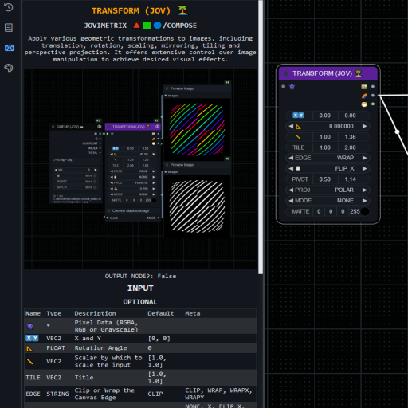
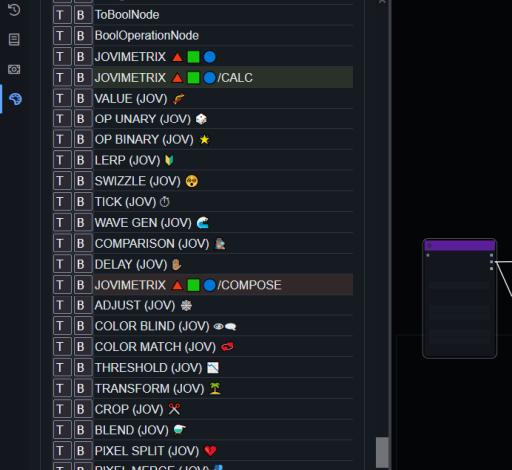

<picture>
  <source media="(prefers-color-scheme: dark)" srcset="https://github.com/Amorano/Jovimetrix-examples/blob/master/res/logo-jovimetrix.png">
  <source media="(prefers-color-scheme: light)" srcset="https://github.com/Amorano/Jovimetrix-examples/blob/master/res/logo-jovimetrix-light.png">
  
</picture>

<h2><div align="center">
<a href="https://github.com/comfyanonymous/ComfyUI">COMFYUI</a> Nodes for procedural masking, live composition and video manipulation
</div></h2>

<h3><div align="center">
JOVIMETRIX IS ONLY GUARANTEED TO SUPPORT <a href="https://github.com/comfyanonymous/ComfyUI">COMFYUI 0.1.2+</a> and <a href="https://github.com/Comfy-Org/ComfyUI_frontend">FRONTEND 1.2.30+</a><br>
IF YOU NEED AN OLDER VERSION, PLEASE DO NOT UPDATE.
</div></h3>

<h2><div align="center">


</div></h2>

<!---------------------------------------------------------------------------->

# SPONSORSHIP

Please consider sponsoring me if you enjoy the results of my work, code or documentation or otherwise. A good way to keep code development open and free is through sponsorship.

<div align="center">

[](https://github.com/sponsors/Amorano)

[](https://www.paypal.com/paypalme/onarom)

[](https://www.patreon.com/joviex)

[](https://ko-fi.com/alexandermorano)

</div>

## HIGHLIGHTS

### HELP SYSTEM

<div align="center">


</div>

The built-in help system will dynamically parse any nodes found at the ComfyUI API endpoint:

`<comfyui_web_root>/object_info`

If those nodes have descriptions written in HTML or Markdown, they will be converted into HTML for presentation in the panel.

### NODE COLORS

<div align="center">


</div>

## UPDATES

**2024/09/04**:
* Import change for chromium tab crash
* Added ComfyUI default "tooltips" as last fallback for help docs
* Supports ComfyUI 0.2.1+, frontend 1.2.45+

**2024/09/03**:
* New `QUEUE TOO` Node focused on efficient image media loading.
* Better reporting in `AKASHIC` Node for core ComfyUI types.
* `MODE` setting for most nodes has been defaulted to `MATTE`. The older `NONE` setting has been removed.
* Thanks to [christian-byrne](https://github.com/christian-byrne) for squashing a bug in [the help sidebar!](https://github.com/Amorano/Jovimetrix/pull/55)
* Thanks to [Ainaemaet](https://github.com/Ainaemaet) for cleaning up the `STREAM READER` Node device list [when no devices are present](https://github.com/Amorano/Jovimetrix/pull/53)!
* Supports ComfyUI 0.2.0+, frontend 1.2.45+

**2024/08/31**:
* Better MASK/ALPHA support for `BLEND`, `ADJUST` and `QUEUE`
* Cleaner Markdown outputs
* Supports ComfyUI 0.1.3+, frontend 1.2.41+

**2024/08/28**:

* New `STRINGER` Node for string operations: Split, Join, Replace and Slice.


* `QUEUE` Node now supports recursing directories. To filter pngs, jpgs, and gifs from the c:/images folder and its sub-folders:

    `c:/images;.png,.jpg,.gif`

    You can add as many extensions as you need, but keep in mind not every image type is supported just because you filter for it -- the Queue node will still return strings where it cant find/load a file type.


* Supports ComfyUI 0.1.3+, frontend 1.2.39+

**2024/08/25**:
* Added conversion coercion for Mixlab Layer types

* Supports ComfyUI 0.1.2+, frontend 1.2.34+

**2024/08/24**:
* All node dynamic help
* Array node -- updated to return single values as their single value, not a list
* Supports ComfyUI 0.1.2+, frontend 1.2.30+

**2024/08/23**:
* Colorization and Help panel only work on new frontend
* Supports ComfyUI 0.1.1+, frontend 1.2.29+

**2024/08/20**:
* Complete Wiki and Examples revamp.
* Supports ComfyUI 0.0.8+, frontend 1.2.30+

# INSTALLATION

[Please see the wiki for advanced use of the environment variables used during startup](https://github.com/Amorano/Jovimetrix/wiki/B.-ASICS)

## COMFYUI MANAGER

If you have [ComfyUI Manager](https://github.com/ltdrdata/ComfyUI-Manager) installed, simply search for Jovimetrix and install from the manager's database.

## MANUAL INSTALL
Clone the repository into your ComfyUI custom_nodes directory. You can clone the repository with the command:
```
git clone https://github.com/Amorano/Jovimetrix.git
```
You can then install the requirements by using the command:
```
.\python_embed\python.exe -s -m pip install -r requirements.txt
```
If you are using a <code>virtual environment</code> (<code><i>venv</i></code>), make sure it is activated before installation. Then install the requirements with the command:
```
pip install -r requirements.txt
```
# WHERE TO FIND ME

You can find me on [](https://discord.gg/62TJaZ3Z5r).